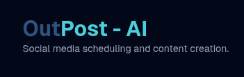
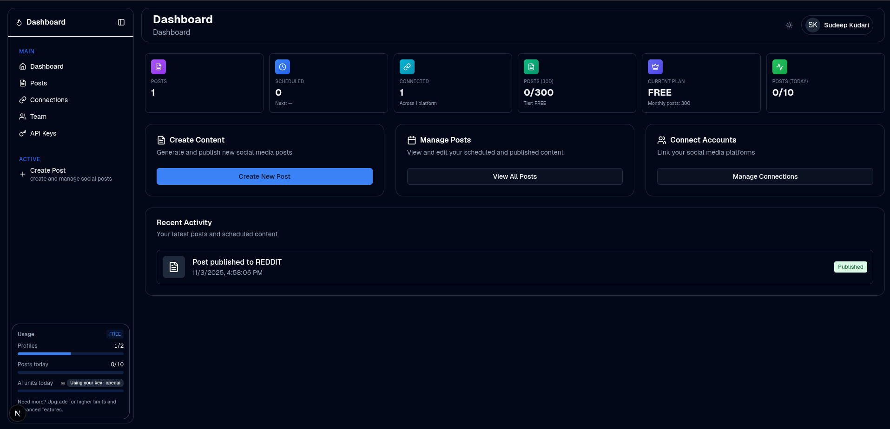

<p align="center">
  
</p>

## OutPost AI — Social Media AI, Composer, and Scheduler

An open-source AI SaaS for social media content generation, multi-platform publishing, and scheduling. Connect Instagram, LinkedIn, Facebook, X (Twitter), Threads, Reddit, TikTok, and YouTube, generate AI content, and publish instantly or on a schedule — all from one dashboard.

---

### Badges

         

---

### Table of Contents

- Overview
- Features
- Supported Platforms
- Architecture
- Screenshots
- Quickstart
- Environment Variables
- How It Works
- Configuration & White‑Labeling
- Deployment
- Testing
- Security & Compliance
- Contributing
- License

---

### Overview

OutPost AI is built for creators, teams, and SaaS founders who want a full-stack, production-ready base for a social media AI tool. It includes AI text generation, media uploads to object storage, OAuth connections to platforms, a publishing pipeline, and a scheduling cron endpoint.

The project is public and intentionally structured so you can clone and rebrand it for your own use.

---

### Features

- **AI copy generation** via OpenAI (and optional Gemini) with platform-aware prompts
- **Multi-platform publishing**: publish to several connected accounts at once
- **Scheduling** with a cron endpoint that processes due posts
- **Media uploads** to object storage (R2 via Thinkroman API)
- **Account & Team features**: invite members, share profiles, manage API keys
- **Usage & Tiering**: free/pro/business/enterprise tier limits scaffold
- **Admin & Analytics primitives** for growth
- **Modern UI/UX** with shadcn/ui, Radix primitives, Tailwind CSS

---

### Supported Platforms

Built-in OAuth and/or publisher support for:

- Instagram, Facebook (via Meta)
- LinkedIn
- X (Twitter) — BYOK required
- Threads
- Reddit
- TikTok
- YouTube

Check `src/lib/social-publishers/*` and `src/lib/*-oauth.ts` for details.

---

### Architecture

- **Framework**: Next.js 15 (App Router), React 19
- **Auth**: NextAuth v5 with Prisma adapter, Google OAuth + Credentials
- **Database**: Prisma with MongoDB (`DATABASE_URL`)
- **RPC**: oRPC (`@orpc/*`) for typed client/server contracts
- **AI**: OpenAI SDK (`OPENAI_API_KEY`), optional Gemini REST
- **Storage**: R2 through Thinkroman API (`S3_TOKEN`) for presigned uploads
- **Email**: Resend (`RESEND_API_KEY`) for transactional emails
- **Styling**: Tailwind CSS, shadcn/ui, Radix UI
- **Tests**: Vitest (unit/integration) and Playwright (e2e)
- **Deploy**: Vercel (includes `vercel.json`)

Key directories:

- `src/app` — routes, API routes, pages, layouts
- `src/lib` — db, auth, AI, publishers, OAuth, mail, flags, utils
- `prisma` — Prisma schema and migrations
- `public/images` — assets, including the logo and screenshots

---

### Screenshots

<p>
  
</p>

---

### Quickstart

Prerequisites

- Node.js 18+ (or 20+ recommended)
- MongoDB (Atlas or self-hosted)
- An OpenAI API key
- OAuth apps for platforms you plan to connect (Google for auth, Twitter/X, Meta, LinkedIn, Reddit, etc.)

Install & Run

```bash
# 1) Install deps
npm install

# 2) Generate Prisma client
npx prisma generate

# 3) (Mongo) Push schema if needed (Mongo uses declarative schema)
npx prisma db push

# 4) Start dev server
npm run dev
```

Optional seed for E2E (requires Bun):

```bash
bun run scripts/create-e2e-users.ts
```

---

### Environment Variables

Create `.env.local` in the project root. Below is a comprehensive set you can copy and tweak:

```env
# App
NEXT_PUBLIC_BASE_URL=http://localhost:3000

# Database (MongoDB)
DATABASE_URL="mongodb+srv://<user>:<pass>@<cluster>/<db>?retryWrites=true&w=majority"

# Auth (NextAuth v5)
AUTH_SECRET=<strong_random_string>
# (Recommended) AUTH_URL in production (Vercel auto-sets NEXTAUTH_URL alternatives)
# AUTH_URL=https://your-domain.com

# Google OAuth (for app sign-in)
GOOGLE_CLIENT_ID=your_google_client_id
GOOGLE_CLIENT_SECRET=your_google_client_secret

# Platform OAuth (BYOK)
TWITTER_CLIENT_ID=your_twitter_client_id
TWITTER_CLIENT_SECRET=your_twitter_client_secret

META_FACEBOOK_APP_ID=your_facebook_app_id
META_FACEBOOK_APP_SECRET=your_facebook_app_secret
META_INSTAGRAM_APP_ID=your_instagram_app_id
META_INSTAGRAM_APP_SECRET=your_instagram_app_secret

LINKEDIN_CLIENT_ID=your_linkedin_client_id
LINKEDIN_CLIENT_SECRET=your_linkedin_client_secret
# Optional LinkedIn flags
LINKEDIN_ENABLE_ORG_SCOPES=false
# LINKEDIN_API_VERSION=202401

REDDIT_CLIENT_ID=your_reddit_client_id
REDDIT_CLIENT_SECRET=your_reddit_client_secret

# AI Providers
OPENAI_API_KEY=your_openai_api_key
# GEMINI_API_KEY=your_gemini_api_key (if you wire it where needed)

# Storage (Thinkroman R2)
S3_TOKEN=your_thinkroman_api_token

# Email (Resend)
RESEND_API_KEY=your_resend_api_key

# Feature Flags (UI)
NEXT_PUBLIC_FEATURE_AI_COMPOSER=true
NEXT_PUBLIC_FEATURE_AI_MEDIA=true
NEXT_PUBLIC_FEATURE_SCHEDULING_QUEUE=true
```

Notes

- Twitter/X requires BYOK. Ensure your developer account and app are approved and configured (see `docs/twitter.md`).
- For Vercel deployments, configure all env vars in the Vercel dashboard.

---

### How It Works

- **Auth**: Configured in `src/auth.ts` with `src/lib/auth/auth.config.ts` (Google OAuth + Credentials). User/session tokens are JWT-based.
- **Profiles/Accounts**: Users create profiles, connect platform accounts via OAuth, and tokens are stored in MongoDB via Prisma.
- **AI Generation**: Backed by `src/lib/openai.ts` (and optional `src/lib/ai/providers/gemini.ts`). The composer UI lives under `src/components/posts/create/*`.
- **Publishing Pipeline**: Publisher abstractions live in `src/lib/social-publishers/*`. The app prepares per-platform content and posts through the respective API using stored tokens.
- **Scheduling**: A cron-safe endpoint at `GET /api/cron/run` processes due posts. Each platform’s publish status is tracked via `PostPlatform`.
- **Media**: Uploaded via presigned URLs from Thinkroman R2 (`src/lib/storage.ts`).

---

### Configuration & White‑Labeling

- **Branding/Logo**: Replace `public/images/postit-logo.png` (and `.svg`) with your own. The README and emails reference this path.
- **Site Metadata & Social Links**: Edit `src/constant/config.ts` (`siteConfig.title`, `description`, `socialLinks`).
- **Emails**: Update branding strings and sender in `src/lib/mail.tsx` (the app name is `PostIt` by default).
- **Feature Flags**: Toggle UI features via `NEXT_PUBLIC_FEATURE_*` in `.env.local` and `src/lib/flags.ts`.

---

### Deployment

Vercel (recommended)

1. Push your repository to GitHub.
2. Import into Vercel and select this project.
3. Set environment variables in the Vercel dashboard.
4. Deploy.

Cron (for scheduling)

- Add a cron job to hit `/api/cron/run` every minute or at your desired cadence.
- On Vercel, you can use Vercel Cron to hit the route periodically.

Prisma on Vercel

- This repo includes `@prisma/nextjs-monorepo-workaround-plugin` and sets binary targets including `rhel-openssl-3.0.x` for compatibility.

---

### Testing

Unit/Integration (Vitest)

```bash
npm run test:unit
# or
npm run test
```

E2E (Playwright)

```bash
npm run test:e2e
```

Refer to `tests/PLAYWRIGHT_FEDORA_SETUP.md` if you’re on Fedora.

---

### Security & Compliance

- Store secrets only in environment variables or your cloud’s secret manager.
- OAuth tokens are persisted; consider encryption at rest or KMS for production.
- Built-in legal pages:
  - `src/app/privacy-policy/page.tsx`
  - `src/app/terms-of-use/page.tsx`
  - `src/app/data-deletion-policy/page.tsx`

---

### Contributing

We welcome contributions!

1. Fork the repo
2. Create a feature branch
3. Install dependencies and run tests
4. Open a PR with a clear description

Pre-commit formatting and linting are configured (Prettier, Biome).

---

### License

MIT — feel free to use this as a base for your own product. Please keep attribution where applicable and comply with third-party API terms (OpenAI, Meta, X, LinkedIn, Reddit, etc.).

---

### Acknowledgements

- OpenAI and Google for LLM APIs
- Prisma + MongoDB
- shadcn/ui + Radix for UI primitives
- Resend for transactional email
- Thinkroman API for R2 storage helpers

An AI-powered social media management application that generates platform-specific content using OpenAI and publishes/schedules posts across multiple social media platforms using the Late API.

## Features

- **AI Content Generation**: Create platform-optimized copy for LinkedIn, Instagram, Twitter/X, and Facebook
- **Multi-Platform Publishing**: Connect and post to multiple social media accounts simultaneously
- **Media Upload**: Upload images and media files through Late's API
- **Scheduling**: Publish immediately or schedule posts for optimal engagement times using cron-job.org
- **Account Management**: Connect and manage multiple social media accounts per platform

## Supported Platforms

- Instagram
- LinkedIn
- Facebook
- Twitter/X (requires BYOK - Bring Your Own Keys)
- TikTok
- YouTube
- Threads

## Tech Stack

- **Framework**: Next.js 15 (App Router)
- **Runtime**: Vercel Edge Functions
- **AI**: OpenAI GPT-4o-mini for content generation
- **Social Media API**: Late API for connections and publishing
- **Styling**: Tailwind CSS
- **UI Components**: shadcn/ui

## Setup

### 1. Environment Variables

Create a `.env.local` file in the root directory:

```env
# OpenAI Configuration
OPENAI_API_KEY=your_openai_api_key

# Base URL (used to build OAuth redirects)
NEXT_PUBLIC_BASE_URL=http://localhost:3000

# Reddit OAuth (create an app at https://www.reddit.com/prefs/apps)
REDDIT_CLIENT_ID=your_reddit_client_id
REDDIT_CLIENT_SECRET=your_reddit_client_secret
```

### 2. Installation

\`\`\`bash

# Install dependencies

npm install

# or

pnpm install

# Start development server

npm run dev

# or

pnpm dev
\`\`\`

### 3. Connect Social Media Accounts

1. Navigate to `/dashboard/create-post`
2. Use the "Connect" buttons to link your social media accounts through Late's OAuth flow
3. Each platform will redirect you through their respective authorization process

## Usage

### Creating and Publishing Posts

1. **Navigate to Dashboard**: Go to `/dashboard/create-post`

2. **Generate Content**:
   - Enter your topic/prompt in the text area
   - Optionally add a link to include in the post
   - Select the tone (Professional, Friendly, Authoritative, Concise)
   - Click "Generate AI Copy"

3. **Upload Media** (Optional):
   - Select an image file
   - Click "Upload to Late" to process the media

4. **Select Accounts**:
   - Choose which connected social media accounts to post to
   - You can select multiple accounts per platform

5. **Publish or Schedule**:
   - Choose "Publish now" for immediate posting
   - Or select "Schedule for" and pick a date/time with timezone
   - Click "Publish Now" or "Schedule"

### Platform-Specific Features

- **Twitter/X**: Supports thread creation for longer content
- **LinkedIn**: Optimized for professional content with first comments
- **Instagram**: Includes hashtag optimization and first comments
- **Facebook**: Supports longer-form content

## API Routes

The application includes several API endpoints:

- `/api/compose` - Generates AI content for all platforms
- `/api/upload` - Uploads media files to Late
- `/api/post` - Publishes or schedules posts
- `/api/late/connect` - Initiates OAuth connection flow
- `/api/late/accounts` - Retrieves connected accounts

## Character Limits

The AI respects platform-specific character limits:

- **Twitter/X**: 280 characters
- **Instagram**: ~2,200 characters
- **LinkedIn**: ~3,000 characters
- **Facebook**: ~63,000 characters

## Error Handling

The application handles various error scenarios:

- **API Rate Limits**: Displays user-friendly messages when limits are reached
- **Upload Failures**: Shows specific error messages for file size or type issues
- **Partial Success**: When some platforms succeed and others fail (HTTP 207)
- **Authentication Issues**: Clear guidance for reconnecting accounts

## Development

### Project Structure

\`\`\`
/app
/api
/compose/route.ts # AI content generation
/upload/route.ts # Media upload to Late
/post/route.ts # Publishing and scheduling
/late
/connect/route.ts # OAuth connection initiation
/accounts/route.ts # Account listing
/dashboard
/create-post/page.tsx # Main dashboard interface
page.tsx # Homepage
layout.tsx # Root layout
globals.css # Global styles
\`\`\`

### Adding New Platforms

To add support for additional platforms:

1. Add the platform to the connect buttons in the dashboard
2. Update the type definitions for supported platforms
3. Add platform-specific content generation rules in the AI prompt
4. Handle any platform-specific API requirements in the post route

## Troubleshooting

### Common Issues

1. **"No accounts connected"**: Make sure you've completed the OAuth flow for at least one platform
2. **"Compose failed"**: Check your OpenAI API key and rate limits
3. **"Upload failed"**: Verify file size is under Late's limits (typically 5GB max)
4. **Twitter/X not working**: Ensure BYOK is configured in your Late dashboard

### Rate Limits

- **OpenAI**: Varies by plan (check your OpenAI dashboard)
- **Late API**: Varies by tier (Free: 60 rpm, Advanced: 1200 rpm)

### Large File Uploads

For files larger than ~4-10MB, Late provides a tokenized upload flow. The current implementation uses direct upload for simplicity.

## Contributing

1. Fork the repository
2. Create a feature branch
3. Make your changes
4. Test thoroughly
5. Submit a pull request

## License

This project is licensed under the MIT License.

## Support

For issues related to:

- **OpenAI**: Check [OpenAI's documentation](https://platform.openai.com/docs)
- **This application**: Open an issue in the repository
